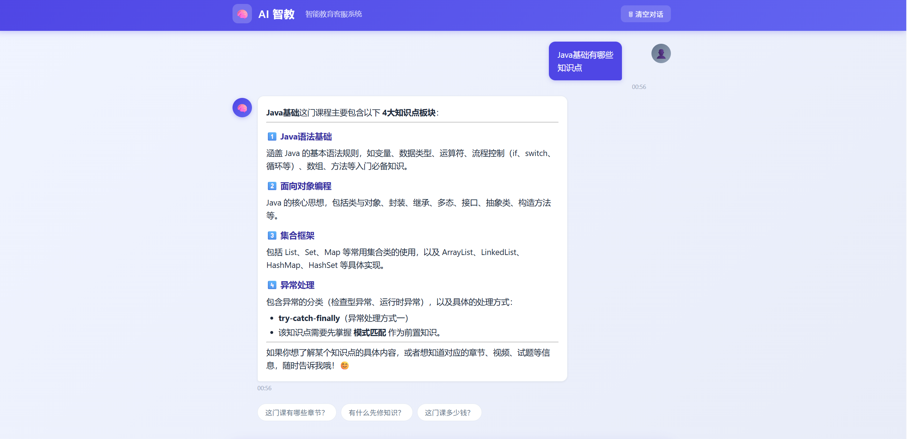
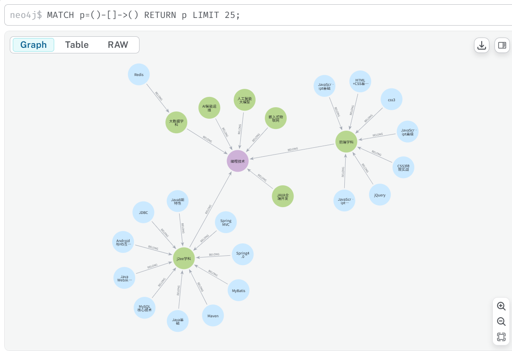

# AI 智教 - 智能教育客服系统

基于知识图谱 + 大模型的智能教育问答系统，支持课程查询、知识点抽取、知识关系推理等功能。

## 截图

| 智能问答界面 | 知识图谱可视化 |
|---|---|
|  |  |

> TODO: 请将页面截图保存至 `screenshots/` 目录

## 功能展示

| 功能 | 说明 |
|------|------|
| 📚 课程查询 | 查询课程信息、知识点、章节结构 |
| 🧠 知识点抽取 | 基于 UIE 模型自动从课程/章节/试题中抽取知识点 |
| 🔗 知识推理 | 知识点先修关系、包含关系、相关关系 |
| 💬 智能问答 | 基于 DeepSeek 大模型 + Neo4j 图数据库的语义问答 |

## 技术栈

- **后端框架**: Python + FastAPI
- **图数据库**: Neo4j
- **关系数据库**: MySQL
- **NLP 模型**: UIE (Universal Information Extraction)，基于 BERT 的少样本实体抽取
- **大模型**: DeepSeek API，用于语义理解与 Cypher 生成
- **前端**: 原生 HTML/CSS/JS，支持 Markdown 渲染与流式输出

## 项目架构

```
用户 ──→ Web 页面（聊天界面）
            │
            ▼
        FastAPI 后端
            │
       ┌────┴────┐
       ▼         ▼
   DeepSeek    Neo4j
   (语义理解)  (知识图谱)
       │         ▲
       └──Cypher─┘
```

## 快速启动

### 1. 环境准备

- Python 3.10+
- MySQL 8.0+
- Neo4j 5.x
- Miniconda（推荐）

### 2. 配置环境

```bash
# 创建 conda 环境
conda create -n ai-smart-edu python=3.12
conda activate ai-smart-edu

# 安装依赖
pip install -r requirements.txt
```

### 3. 初始化数据

```bash
# 导入 MySQL 数据
mysql -u root -p < data/edu.sql

# 同步数据到 Neo4j
python src/datasync/data_prepare.py
```

### 4. 配置环境变量

创建 `.env` 文件：

```env
DEEPSEEK_API_KEY=your_api_key_here
```

### 5. 启动服务

```bash
uvicorn src.backend.app:app --reload
```

访问 http://localhost:8000

### 使用 Docker

```bash
docker-compose up -d
```

## 项目结构

```
ai-smart-edu/
├── src/
│   ├── backend/           # Web 服务
│   │   ├── app.py         # FastAPI 入口
│   │   ├── chat_service.py# 对话服务（DeepSeek 函数调用）
│   │   └── templates/     # 前端页面
│   ├── agent/             # 大模型 Agent
│   │   ├── prompts.py     # 系统提示词
│   │   └── tools_def.py   # 工具定义
│   ├── entity_extraction/ # 知识点抽取（UIE）
│   │   ├── extractor.py   # 抽取接口
│   │   ├── trainer.py     # 训练脚本
│   │   └── train.py       # 训练入口
│   ├── datasync/          # 数据同步
│   │   ├── db_utils.py    # 数据库连接
│   │   └── data_prepare.py# 同步脚本
│   └── configuration/     # 配置
├── data/edu.sql           # MySQL 数据库脚本
├── uie_pytorch/           # UIE 模型框架
├── finetuned/             # 微调模型权重
├── docker-compose.yml     # Docker 编排
└── Dockerfile             # 应用容器
```

## 核心流程

### 数据处理流程

1. **数据同步**: MySQL 中的课程、章节、试题等数据通过 `data_prepare.py` 同步到 Neo4j
2. **知识点抽取**: 使用微调后的 UIE 模型从课程介绍、章节名称、试题文本中抽取知识点
3. **知识关联**: 建立知识点之间的相关、包含、先修关系

### 问答流程

1. 用户输入自然语言问题
2. DeepSeek 理解问题意图，生成 Cypher 查询语句
3. 执行 Cypher 查询 Neo4j 图数据库
4. DeepSeek 将查询结果整理为自然语言回答

## 许可证

MIT License
